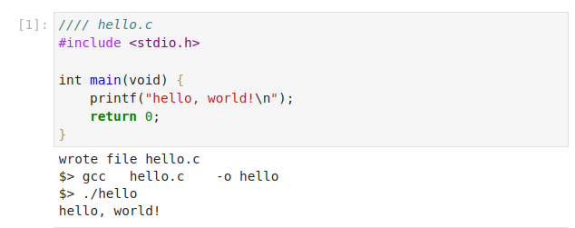
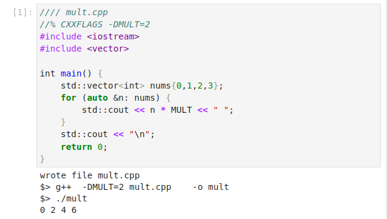
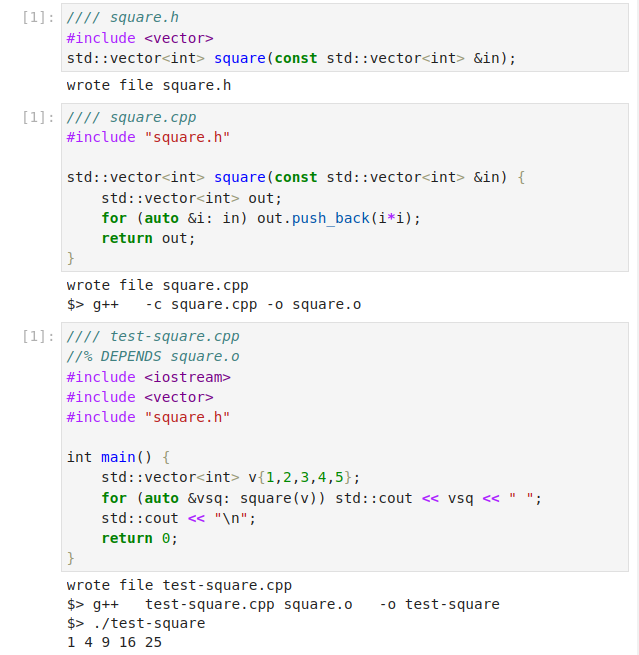
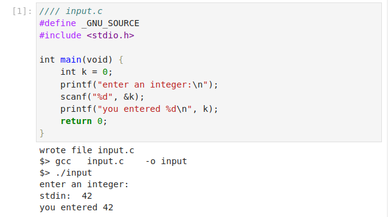

# c-kernel

This package provides a Jupyter kernel which allows automatic compilation and
execution of C/C++ code from a notebook environment.

Documentation:

- [Installation](https://c-kernel.readthedocs.io/en/latest/00-install.html)
- [Using c-kernel](https://c-kernel.readthedocs.io/en/latest/01-use.html)
- [Examples](https://c-kernel.readthedocs.io/en/latest/02-example.html)
- [FAQs](https://c-kernel.readthedocs.io/en/latest/03-FAQ.html)

## Features

Using c-kernel, you can:

- Automatically compile and execute code cells

- Add compiler options using `//%` magic comments

- Compose multi-file programs in a single notebook

- Get user input interactively

## Contact

For any issues, comments or feature requests, please go to the [issues page](https://github.com/adamtuft/c-kernel/issues).

## License and Copyright

Copyright (c) 2023, Adam Tuft

c-kernel is released under the BSD 3-clause license. See [LICENSE](<https://github.com/adamtuft/c-kernel/blob/main/LICENSE>) for details.
