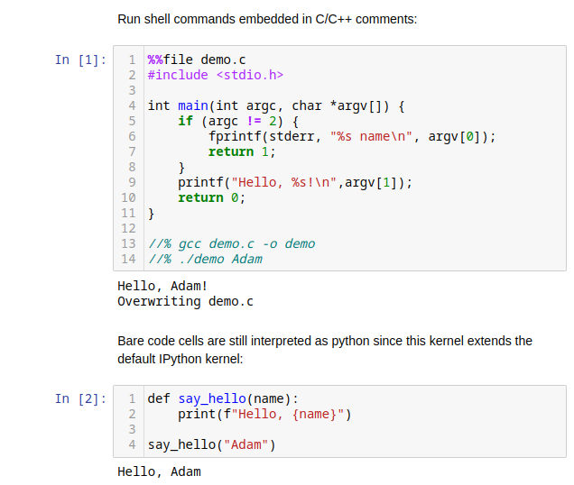

# c-kernel

IPython kernels for teaching and learning C/C++ in a Jupyter notebook, providing
C/C++ syntax highlighting, automatic compilation and a little more magic.

#### `AsyncKernel`

This kernel (an extension of the default IPython kernel) provides the ability to execute shell commands embedded in comments when the cell contents are saved using the `%%file`
cell magic:

<p align="center">

</p>

#### `AutoCompileKernel`

Automatically compile cells into object files or executables using the name
given on the cell's first line:

<p align="center">

</p>

Specify options in comments using `//%`:

<p align="center">

</p>

Compose simple multi-file projects in a single notebook:

<p align="center">

</p>

## Installation

To install from git:

```
git clone git@github.com:adamtuft/c-kernel.git
python3 -m pip install ./c-kernel
```

Then, install the kernel(s), giving it a name and a display name of your choice.
For example, to install `AutoCompileKernel` using `clang` and `clang++` as the
default compilers, run:

```
ckernel install AutoCompileKernel autocompile-clang "Auto-compile C/C++ (clang)" --user --cc clang --cxx clang++
```

This kernel will then be available under the name "Auto-compile C/C++ (clang)"
in Jupyter:

<p align="center">

</p>

See `ckernel install --help` for all options.

## License

Licensed under the BSD 3-Clause License (see the [license file](LICENSE)).

Copyright (c) 2023, Adam Tuft
