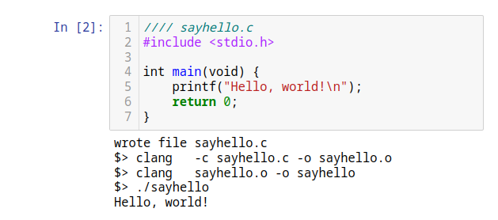
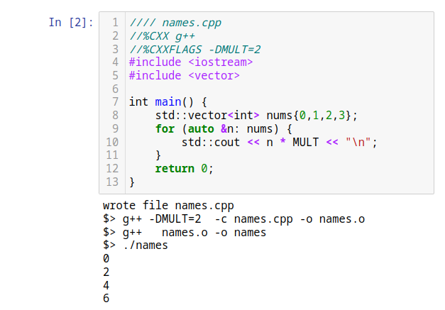
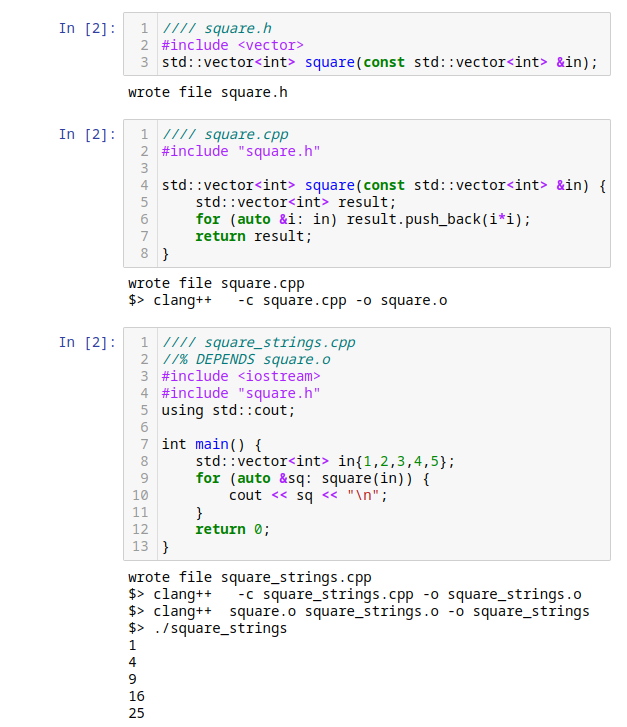
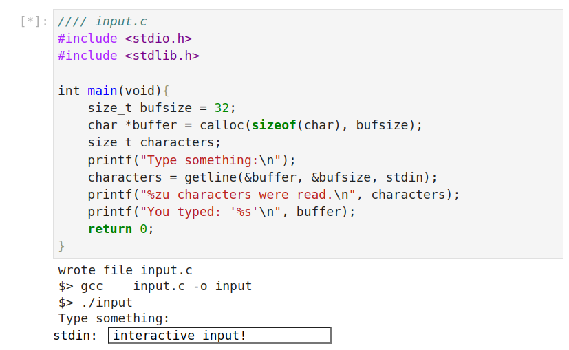
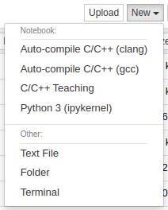

# c-kernel

IPython kernels for teaching and learning C/C++ in a Jupyter notebook, providing
C/C++ syntax highlighting, automatic compilation and a little more magic.

## `AutoCompileKernel`

Automatically compile cells into object files or executables using the name
given on the cell's first line:

<p align="center">

</p>

Specify options in comments using `//%`:

<p align="center">

</p>

Compose simple multi-file projects in a single notebook:

<p align="center">

</p>

Interactive text input between notebook and the compiled executable:

<p align="center">

</p>

### Available options

The following options can be specified in a `//%` magic comment within a code cell:

| Option      | Meaning                                           | Example               |
| ----------- | ------------------------------------------------- | --------------------- |
| `CC`        | set the C compiler                                | `CC clang`            |
| `CXX`       | set the C++ compiler                              | `CXX clang++`         |
| `CFLAGS`    | add C compilation flags                           | `CFLAGS -Wall`        |
| `CXXFLAGS`  | add C++ compilation flags                         | `CXXFLAGS -std=c++17` |
| `LDFLAGS`   | add linker flags                                  | `LDFLAGS -lm`         |
| `DEPENDS`   | add .o dependencies, separated by spaces          | `DEPENDS mycode.o`    |
| `VERBOSE`   | extra output from the kernel                      |                       |
| `ARGS`      | command-line arguments to the executable          | `ARGS arg1 arg2 etc`  |
| `NOCOMPILE` | save and don't compile the code cell              |                       |
| `NOEXEC`    | save and compile, but don't execute the code cell |                       |

## Installation

To install from git:

```
git clone git@github.com:adamtuft/c-kernel.git
python3 -m pip install ./c-kernel
```

Then, install the kernel(s), giving it a name and a display name of your choice.
For example, to install `AutoCompileKernel` using `clang` and `clang++` as the
default compilers, run:

```
ckernel install AutoCompileKernel autocompile-clang "Auto-compile C/C++ (clang)" --user --cc clang --cxx clang++
```

This kernel will then be available under the name "Auto-compile C/C++ (clang)"
in Jupyter:

<p align="center">

</p>

Here are some commands for installing the kernel for use with `clang` and `gcc`, with both regular and debug versions:

```bash
python3 -m ckernel install AutoCompileKernel autocompile-gcc "Auto-compile C/C++ (gcc)" --user --cc gcc --cxx g++
python3 -m ckernel install AutoCompileKernel autocompile-gcc-debug "Auto-compile C/C++ (gcc) (debug)" --user --debug --cc gcc --cxx g++
python3 -m ckernel install AutoCompileKernel autocompile-clang "Auto-compile C/C++ (clang)" --user --cc clang --cxx clang++
python3 -m ckernel install AutoCompileKernel autocompile-clang-debug "Auto-compile C/C++ (clang) (debug)" --user --debug --cc clang --cxx clang++
jupyter kernelspec list
```

See `ckernel install --help` for all options.

## Issues

Please report any issues on [GitHub](https://github.com/adamtuft/c-kernel/issues).

## License

Licensed under the BSD 3-Clause License (see the [license file](LICENSE)).

Copyright (c) 2023, Adam Tuft
